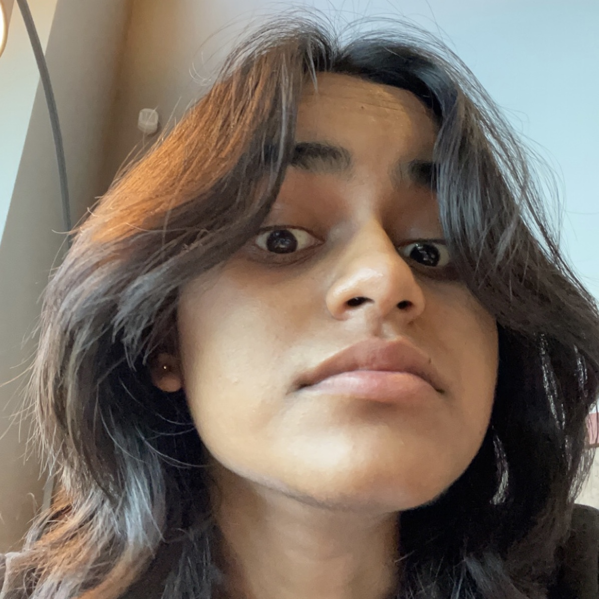
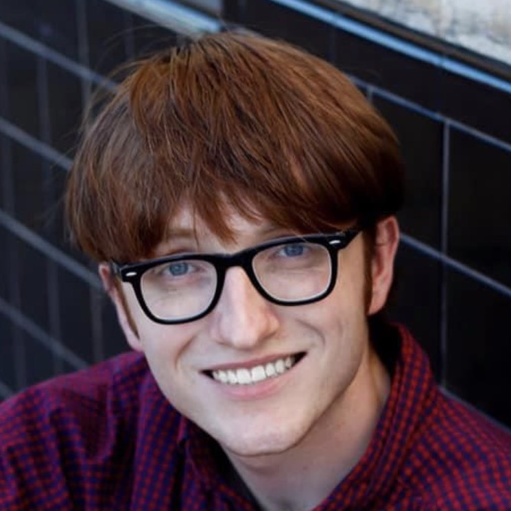
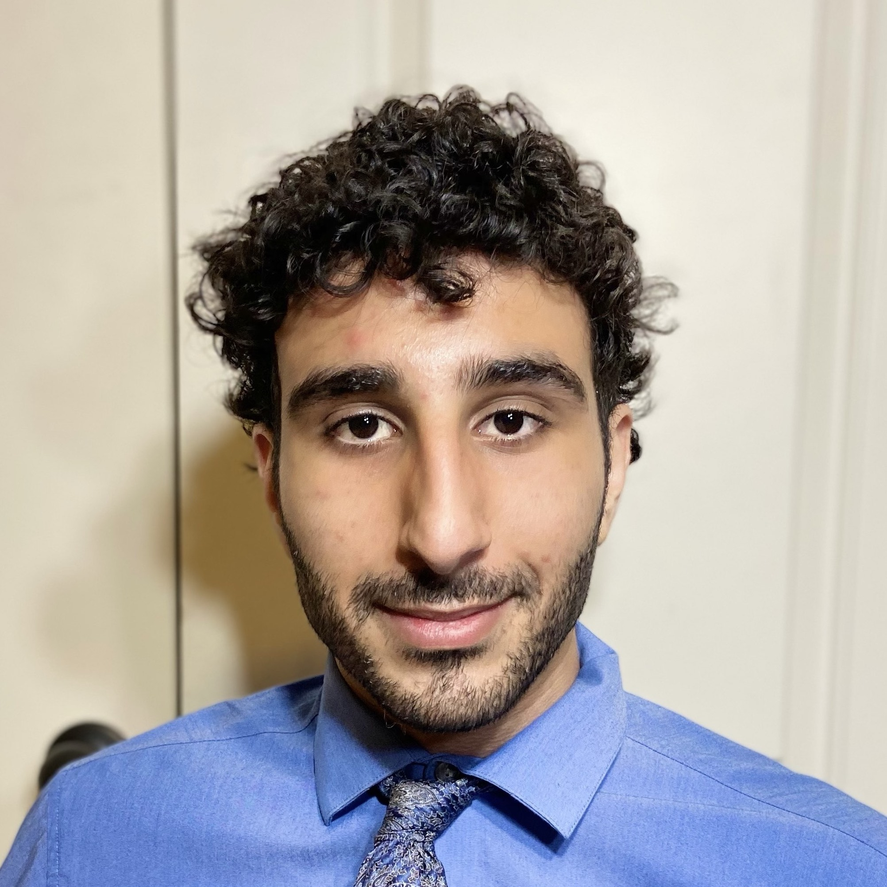
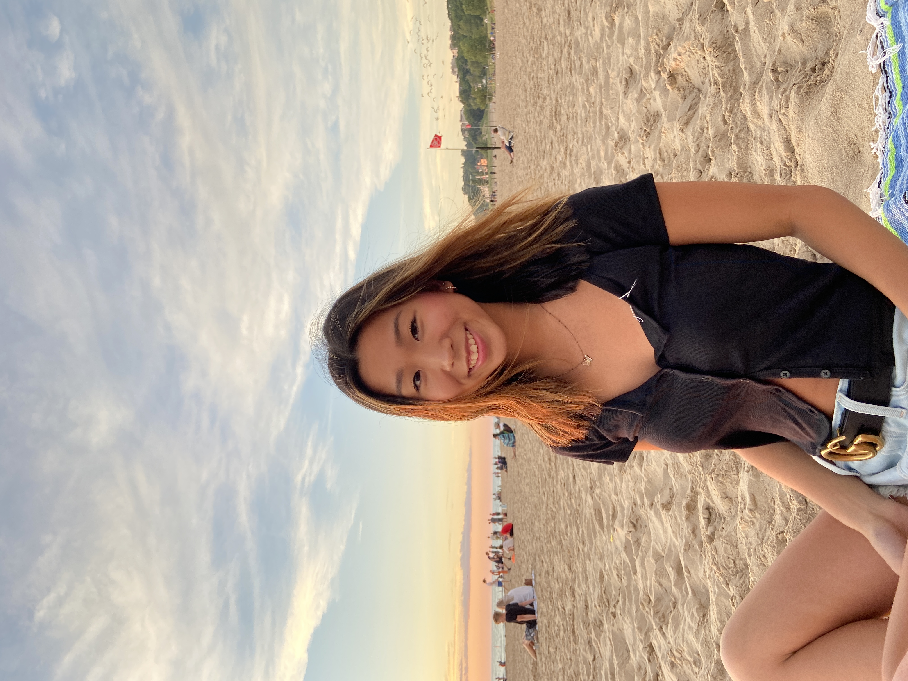

# Participate in Our Research

## TLDR: [Participate](https://tamu.qualtrics.com/jfe/form/SV_eo0kzCiiVRzIark) in research and get paid $10/hour!

<!-- create a button for url -->
<a href="https://tamu.qualtrics.com/jfe/form/SV_eo0kzCiiVRzIark" class="button">Participate</a>

 

**About us**
The Neuroergonomics lab at the Texas A&M Industrial and Systems Engineering Department is looking for participants for conducting a research study on human-robot teaming. This study was approved by the TAMU Institutional Review Board (IRB2022-0473DCR) on 10/05/2022.

**What will you be doing?**
Participants will attend one, four-hour session and work in a team comprising of three agents. The other two agents will be a combination of other participants and a simulated robot. The team will be carrying out a search of victims in a virtual environment simulating emergency situation. During the session, brain activity, heart rate, and eye tracking will be measured.

**Where?**
The study will be conducted in room 2005C of Emerging Technologies Building, 101 Bizzell St, College Station, TX 77843.

**Compensation**
Participants will be compensated at a rate of $10/hour. The study is expected to take 4 hours.

**Eligibility**: You are/have:
1. Between 18 and 45 years of age
2. Proficient in English
3. No implant device
4. No visual, hearing, or limb impairments
5. No known history of experiencing motion sickness
6. No apparent physical or cognitive limitations that might influence performance in the study
7. Not on any medications related to psychological/psychiatric/mental health problems
8. No known allergies to latex, sensor adhesives, or electrode gels
9. No known history of photosensitive epilepsy
10. Not pregnant

If you are interested in participating, please [REGISTER](https://tamu.qualtrics.com/jfe/form/SV_eo0kzCiiVRzIark) or email Aakash (aakash@tamu.com) for more information about the study!

 
 

## Research Team

### Summer 2023

  

    
    <h3 style="text-align: center"><a href="https://nimrobotics.com/">Aakash</a></h3>
  

  

    
    <h3 style="text-align: center"><a>Patralika Ghosh</a></h3>
  

  

    
    <h3 style="text-align: center"><a href="https://www.linkedin.com/in/ranjanamehta/">Ranjana K. Mehta</a></h3>
  

### Spring 2023

  

    
    <h3 style="text-align: center"><a href="https://nimrobotics.com/">Aakash</a></h3>
  

  

    
    <h3 style="text-align: center"><a>Thomas Bolf</a></h3>
  

  

    
    <h3 style="text-align: center"><a href="https://www.linkedin.com/in/malik-rawashdeh-a5678b1b6/">Malik Rawashdeh</a></h3>
  

  

    
    <h3 style="text-align: center"><a>Patralika Ghosh</a></h3>
  

  

    
    <h3 style="text-align: center"><a>Diane Lee</a></h3>
  

    

    
    <h3 style="text-align: center"><a href="https://www.linkedin.com/in/ranjanamehta/">Ranjana K. Mehta</a></h3>
  

### Fall 2022

  

    
    <h3 style="text-align: center"><a href="https://nimrobotics.com/">Aakash</a></h3>
  

  

    
    <h3 style="text-align: center"><a href="https://www.linkedin.com/in/carlos-meisel/">Carlos Meisel</a></h3>
  

  

    
    <h3 style="text-align: center"><a>Thomas Bolf</a></h3>
  

  

    
    <h3 style="text-align: center"><a href="https://www.linkedin.com/in/malik-rawashdeh-a5678b1b6/">Malik Rawashdeh</a></h3>
  

  

    
    <h3 style="text-align: center"><a>Patralika Ghosh</a></h3>
  

  

    
    <h3 style="text-align: center"><a>Diane Lee</a></h3>
  

    

    
    <h3 style="text-align: center"><a href="https://www.linkedin.com/in/ranjanamehta/">Ranjana K. Mehta</a></h3>
  

### Spring and Summer 2022

  

    
    <h3 style="text-align: center"><a href="https://nimrobotics.com/">Aakash</a></h3>
  

  

    
    <h3 style="text-align: center"><a href="https://www.linkedin.com/in/carlos-meisel/">Carlos Meisel</a></h3>
  

  

    
    <h3 style="text-align: center"><a href="https://www.linkedin.com/in/chris-notzon-8a8b0415a/">Chris Notzon</a></h3>
  

  

    
    <h3 style="text-align: center"><a href="https://www.linkedin.com/in/ranjanamehta/">Ranjana K. Mehta</a></h3>
  

 
 
### Corresponding author

Aakash Yadav [aakash@tamu.edu](mailto:aakash@tamu.edu) 

<!-- <iframe src="poster.pdf" width="100%" height="500px"> </iframe>  -->

## Problem Statement

## Conceptualization

## Measurements
- [fNIRS](https://www.nimh.nih.gov/research/fNIRS/)
- [Tobii Nano](https://www.tobii.com/en-us/products/nano-eye-tracking/)
- [ECG](https://www.actiheart.com/)
- [EEG](https://www.brainproducts.com/en/products/brain-vision-recorder/)

## Tech Stack
- [Unity](https://unity3d.com/)
- [C#](https://docs.microsoft.com/en-us/dotnet/csharp/)
- [python](https://www.python.org/)
- [ROS](https://www.ros.org/)
- [MATLAB](https://www.mathworks.com/)

## Timeline

## Participate
In order to participate in this project, you will need to be physically present at the lab at TAMU. The experiment is currently undergoing internal testing, register [here](https://forms.gle/4YYi2Exzs5MyREZu5) to get notified when the experiment is ready.

## Provide Feedback
Our team is always looking for feedback on our project. Please contact us at [aakash@tamu.edu](mailto:aakash@tamu.edu) or [nimrobotics@gmail.com](mailto:nimrobotics@gmail.com).

<!-- reference the papers -->
## References
- [1] `Hopko, S. K., & Mehta, R. K. Neural Correlates of Trust in Automation: Considerations and Generalizability Between Technology Domains. Frontiers in Neuroergonomics, 26.`

- [2] `Hopko, S. K., Khurana, R., Mehta, R. K., & Pagilla, P. R. (2021). Effect of Cognitive Fatigue, Operator Sex, and Robot Assistance on Task Performance Metrics, Workload, and Situation Awareness in Human-Robot Collaboration. IEEE Robotics and Automation Letters, 6(2), 3049-3056.`

